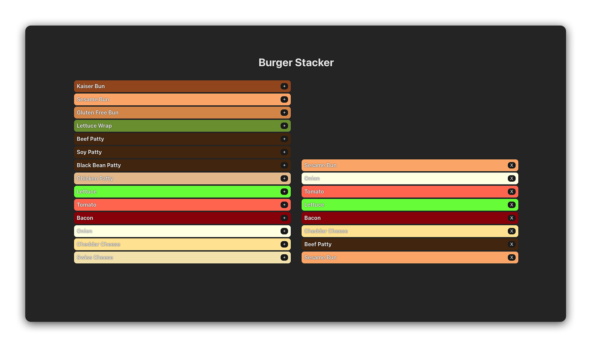
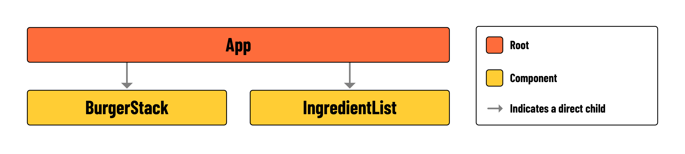

# Introduction
Before diving into the exercise, take a moment to inspect the code provided to you during setup. You’ll find code for two new components and a complete CSS stylesheet. Your primary focus will be on using React to execute the user stories below, reinforcing the concept of lifting state.

## What you’ll build

In this lab, you’ll be building a burger stacker application. The interface will be divided into two main areas. On one side, you’ll have a list of ingredients. Users can select from these ingredients, and upon selection, these items will move to the other side of the screen. This second area is where the user’s burger is visually constructed. As ingredients are added, they’ll appear stacked in the order they were selected, forming a burger.

Below is a component hierarchy diagram to illustrate how the application will be structured:

App: The parent component containing < BurgerStack > and < IngredientList >. It will also contain stack state, and two functions for manipulating that state.
BurgerStack: A < ul > that renders the elements held in stack. Each ingredient rendered in this component should contain a button for removing the ingredient from the stack.
IngredientList: A < ul>  that renders the elements held in availableIngredients. Each ingredient rendered in this component should contain a button for adding the ingredient to the stack.
🏆 Pay special attention to the availableIngredients array held in src/App.jsx. You’ll likely begin by rendering this data.

## User stories
Here are the user stories for this lab:

- [x] As a user, I want to be able to see a list of the ingredients that can be added to my burger on the left side of the screen.

- [x] As a user, I want to be able to see a stack of the ingredients that make up my burger on the right side of the screen.

- [x] As a user, I want to click a ‘+’ button on an ingredient to add it to my burger stack. This action will place the ingredient on the stack displayed on the right side of the screen, while keeping the original ingredient list on the left unchanged.

- [x] As a user, I want to click an ‘X’ button on an ingredient in my burger stack to remove it. This will take the ingredient off the stack on the right side of the screen, without changing the ingredient list on the left.

